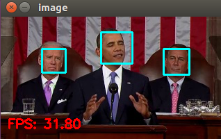

# Face Recognition Demo App

Detect, identify and track faces from a video stream. 

The `frame_generator.py` file reads frames from a video file or camera stream. Each frame can be passed to either a 
`detection.py` or `tracking.py` module. Both modules use [OpenCV's](https://opencv.org) Haar Cascades classifier to 
detect faces in the frame. 

If faces are found in the frame, the tracking module further calls `recognition.py`, which uses the 
[`face_recognition`](https://github.com/ageitgey/face_recognition) module built on top of [dlib](http://dlib.net/).
Face encodings evaluated in the frame are compared against known encodings from a pre-trained model. `recognition.py` 
then returns a list of bounding boxes and identified face labels data back to `tracking.py`.

`tracking.py` then assigns a 'tracker' to each of the bounding boxes and tracks them in a specified number of 
subsequent frames according to one of the OpenCV's tracking algorithms. It calls `recognition.py` again after this 
number of frames and the process repeats. The number of frames to track is a trade-off since face recognition is more 
compute intensive than tracking but is also more robust.

It is logical to move the compute heavy face recognition task to a more capable node, while the frame generation, 
detection and tracking can run on a node with modest resources. This is achieved via 'Sapphirization' of the face 
recognition task. Corresponding Java wrappers are provided for each of the Python files.

The Python files and the corresponding Java wrappers that implement the application logic are located in the 
`src/main/java/facerecog` directory of the project. The main application is located in `src/main/java/application` 
directory. The Haar Cascades file and the known encodings file are located in the `src/main/resources` directory along 
with a sample video to process.

The processed output frames can either be saved into a video file (in `src/main/savedVideos`) 
or displayed in a window as a live stream.

## Installation

### Prerequisites

```
Python Version - 3.5+
OpenCV and OpenCVContrib Versions - 3.4+
```
**Note:** OpenCV and OpenCVContrib versions should be the same. Tested with python version 3.5.2 and openCV version 3.4.2 .

A `Dockerfile` has been provided to build a Docker image with all the dependencies (OpenCV, face_recognition, dlib, and
jdk1.8.0_181) for this project to run. You may customize this file to suite your needs.

More information on setting up OpenCV and Python bindings on Ubuntu can be found 
[here](https://www.pyimagesearch.com/2016/10/24/ubuntu-16-04-how-to-install-opencv/). Information to setup 
`face_recognition`, `dlib` and some related helper modules used in this demo can be found
[here](https://www.pyimagesearch.com/2018/06/18/face-recognition-with-opencv-python-and-deep-learning/). Make sure to 
use appropriate cmake flags to enable multicore/GPU optimizations to improve performance if you need them.

The python path needs to be changed accordingly before running the app.

To build the Docker image, clone this repo and type at the project root:
```bash
$ docker build .
```

You can now run three instances of the generated image as containers, one each for the OMS, the KernelServer and the DemoApp. To
run these containers, type in three separate terminal windows:
```bash
$ xhost +
$ docker run -it -e DISPLAY=$DISPLAY \
                 -e NO_AT_BRIDGE=1 \
                 -e JAVA_HOME=/root/jdk1.8.0_181 \
                 --privileged --device /dev/video0 \
                 --privileged -v /tmp/.X11-unix:/tmp/.X11-unix:ro yourImageName /bin/bash
```
Note that this use of flags is necessary in order to use a camera on your host system and display the processed live 
video in a window on the host system's X server (tested on Ubuntu). This would be required only for the container 
running the DemoApp.

## Usage

This Java project uses Gradle wrapper to automate the build and run. Each container is self-contained and has the project
directory located at `/home/face-recognition-demo/` folder as specified in the Dockerfile. Each container uses the 
parameters specified in the `gradle.properties` file in that folder to talk to other containers. So, make sure that the
 parameters specified in the corresponding `gradle.properties` file are identical for all the containers. You need to 
 specify the ip and port for OMS and KernelServer.

You can find the ip of the container by typing the following inside the container:
```bash
$ awk 'END{print $1}' /etc/hosts
```

You can also specify the `sourceType` for the input stream of frames to be a video file or a camera, and `targetType` to 
be a file or a windowed display for the stream of processed frames. The type of processing desired, detection or 
tracking, is specified via `inferenceType`.

Finally, build the project in each container as:
```bash
$ ./gradlew build
```
followed by
```bash
$ ./gradlew runoms
```
in the OMS container;
```bash
$ ./gradlew runks
```
in the KernelServer container; and
```bash
$ ./gradlew runapp
```
in the DemoApp container.


Once done and you exit the container, make sure to type:
```bash
$ xhost -
```

## Features

#### Detect faces in the video stream


#### Identify and track faces in the video stream


