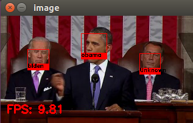

# Face Recognition Demo App

Detect, identify and track faces from a video stream. 

The `frame_generator.py` file reads frames from a video file or camera stream. Each frame can be passed to either a 
`detection.py` or `tracking.py` module. Both modules use [OpenCV's](https://opencv.org) Haar Cascades classifier to 
detect faces in the frame. 

If faces are found in the frame, the tracking module further calls `recognition.py`, which uses the 
[`face_recognition`](https://github.com/ageitgey/face_recognition) module built on top of [dlib](http://dlib.net/).
Face encodings evaluated in the frame are compared against known encodings from a pre-trained model. `recognition.py` 
then returns a list of bounding boxes and identified face labels data back to `tracking.py`.

`tracking.py` then assigns a 'tracker' to each of the bounding boxes and tracks them in a specified number of 
subsequent frames according to one of the OpenCV's tracking algorithms. It calls `recognition.py` again after this 
number of frames and the process repeats. The number of frames to track is a trade-off since face recognition is more 
compute intensive than tracking but is also more robust.

It is logical to move the compute heavy face recognition task to a more capable node, while the frame generation, 
detection and tracking can run on a node with modest resources. This demo enables migrating face recognition by using
ExplicitMigrationPolicy DM. To achieve this, corresponding Java wrappers are provided for each of the Python files.

The processed output frames can either be saved into a video file or displayed in a window as a live stream.

## Installation

Detailed instructions on setting up OpenCV and Python bindings on Ubuntu can be found 
[here](https://www.pyimagesearch.com/2016/10/24/ubuntu-16-04-how-to-install-opencv/). Instructions to setup 
`face_recognition`, `dlib` and some related helper modules used in this demo can be found
[here](https://www.pyimagesearch.com/2018/06/18/face-recognition-with-opencv-python-and-deep-learning/). Make sure to 
use appropriate cmake flags to enable multicore/GPU optimizations to improve performance.

It is assumed that Sapphire has been setup and the Java wrapper code has access to the dependencies.

## Usage

The setup is similar to that described in 
[development wiki](https://github.com/Huawei-PaaS/DCAP-Sapphire/blob/master/docs/Development.md).

Edit the Run/Debug Configurations in IntelliJ IDEA as follows:

 
where {proj_path} is the root of the project tree.

Run them sequentially.

## Features

Video stream can be generated from a video file or a webcam, as specified by the `sourceType` field in `DemoAppStart`. 
Likewise, the processed video stream can be saved to a file or displayed in a window, specified by the `outputType` 
field in the wrapper codes, `Detection` and `Tracker`.

#### Detect faces in the video stream

#### Identify and track faces in the video stream

